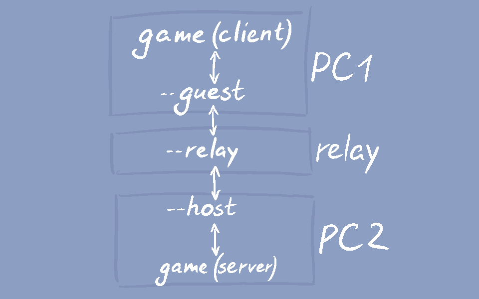

# A tiny tunnel server!

This is a node.js app that solves a specific annoyance:
playing games between two computers that cannot connect over P2P,
even with hole-punching.



<details open>
<summary>Text form</summary>

<table><tr><td>
	Application
</td><td>
	Device
</td></tr><tr><td>
	game (client)
</td><td rowspan="2">
	PC1
</td></tr><tr><td>
	tiny-tunnel (--guest)
</td></tr><tr><td>
	tiny-tunnel (--relay)
</td><td>
	Relay
</td></tr><tr><td>
	tiny-tunnel (--host)
</td><td rowspan="2">
	PC2
</td></tr><tr><td>
	game (server)
</td></tr></table>

</details>

## Building

Install [Haxe](https://haxe.org/) if you don't have it;
```
haxe build.hxml
```
This creates `bin/tiny-tunnel.js`

## Running

You'll need [node.js](https://nodejs.org/) installed.
Any semi-recent version should do.

Open a command prompt / terminal in the `bin` directory
or copy `tiny-tunnel.js` wherever you'd like.

### Relay

```sh
node tiny-tunnel.js --relay --host-port 9000 --guest-port 9001
```

#### --host-port port
The port for the host player (the one hosting a game server) to connect to.

#### --guest-port port
The port for the guest player (the one joining a game server) to connect to.

### Host

```sh
node tiny-tunnel.js --host --relay-ip 127.0.0.1 --relay-port 9000 --connect-port 7800
```

#### --relay-ip address
The IP address of the relay.

#### --relay-port port
The relay port to connect to (see `--host-port` above).

#### --connect-port port
The port where a game server is hosted.

#### --connect-ip address
If the game server is hosted on another computer
(e.g. a home server without internet access),
you can use this.

Otherwise the app will attempt connect to a server on `localhost` / `127.0.0.1`.

### Guest
```sh
node tiny-tunnel.js --guest --relay-ip 127.0.0.1 --relay-port 9001 --server-port 7700
```

#### --relay-ip address
The IP address of the relay.

#### --relay-port port
The relay port to connect to (see `--guest-port` above).

### --server-port port
The port to host a local server on.

When a game connects to this port, a local client will be created on the host's side
to connect to the game server and data will be forwarded back and forth.

When the guest's local client disconnects or the host destroys the client,
the local client on the other side will be destroyed.